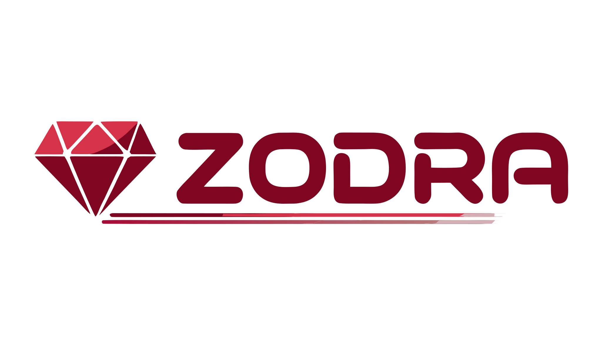

<p align="center">
  
</p>

<p align="center">
  <strong>End-to-end type system for Rails</strong><br>
  Define types once in Ruby DSL. Generate TypeScript interfaces and Zod schemas for your frontend.
</p>

<p align="center">
  <em>Work in progress — not yet published to RubyGems or npm.</em>
</p>

---

## Overview

Zodra is a full API framework for Rails that bridges the gap between backend and frontend type safety. You define your types, contracts, and API structure in a Ruby DSL — Zodra handles validation, serialization, routing, and code generation.

**One definition, both sides:**

```
Ruby DSL  →  TypeScript interfaces  +  Zod schemas
          →  Params validation      +  Response serialization
          →  Resource routing       +  Controller helpers
```

## Features

- **Type DSL** — objects, enums, unions with full attribute support (optional, nullable, defaults, constraints)
- **Contracts** — define params and responses per action, decoupled from routing
- **Resource Routing** — `Zodra.api` maps contracts to RESTful routes with nested resources and custom actions
- **Params Validation** — strict by default, coerces and validates incoming params against contract schemas
- **Response Serialization** — consistent `{ data: ... }` / `{ data: [...], meta: ... }` envelope
- **TypeScript Export** — generates `.ts` interfaces from your type definitions
- **Zod Export** — generates `.ts` schemas with constraints (`z.string().min(1)`, `z.number().int()`)
- **Controller Mixin** — `include Zodra::Controller` for `zodra_params`, `zodra_respond`, error handling
- **Rails Native** — Railtie, rake tasks, works with Zeitwerk and standard Rails conventions

## Quick Start

### Installation

Add to your Gemfile:

```ruby
gem "zodra", path: "gem" # or from git/rubygems when published
```

### 1. Define a Type

```ruby
# app/types/product.rb
Zodra.type :product do
  uuid    :id
  string  :name
  string  :sku
  decimal :price
  integer :stock
  boolean :published
end
```

### 2. Define a Contract

```ruby
# app/contracts/products.rb
Zodra.contract :products do
  action :index do
    response :product, collection: true
  end

  action :show do
    params do
      uuid :id
    end
    response :product
  end

  action :create do
    params do
      string  :name, min: 1
      string  :sku, min: 1
      decimal :price, min: 0
      integer :stock, min: 0
      boolean :published, default: false
    end
    response :product
  end

  action :update do
    params do
      uuid     :id
      string?  :name, min: 1
      string?  :sku, min: 1
      decimal? :price, min: 0
      integer? :stock, min: 0
      boolean? :published
    end
    response :product
  end

  action :destroy do
    params do
      uuid :id
    end
  end
end
```

### 3. Define the API

```ruby
# config/apis/v1.rb
Zodra.api "/api/v1" do
  resources :products
end
```

### 4. Set Up Routes

```ruby
# config/routes.rb
Rails.application.routes.draw do
  zodra_routes
end
```

### 5. Write the Controller

```ruby
# app/controllers/api/v1/products_controller.rb
module Api
  module V1
    class ProductsController < ApplicationController
      include Zodra::Controller

      zodra_contract :products

      def index
        products = Product.all
        zodra_respond_collection(products)
      end

      def show
        product = Product.find(zodra_params[:id])
        zodra_respond(product)
      end

      def create
        product = Product.create!(zodra_params)
        zodra_respond(product, status: :created)
      end

      def update
        product = Product.find(zodra_params[:id])
        product.update!(zodra_params.except(:id))
        zodra_respond(product)
      end

      def destroy
        product = Product.find(zodra_params[:id])
        product.destroy!
        head :no_content
      end
    end
  end
end
```

### 6. Export to TypeScript + Zod

```bash
bin/rails zodra:export
# Generated app/javascript/types/schemas.ts
# Generated app/javascript/types/types.ts
```

**Generated TypeScript:**

```typescript
export interface Product {
  id: string;
  name: string;
  sku: string;
  price: number;
  stock: number;
  published: boolean;
}
```

**Generated Zod:**

```typescript
import { z } from 'zod';

export const ProductSchema = z.object({
  id: z.string().uuid(),
  name: z.string(),
  sku: z.string(),
  price: z.number(),
  stock: z.number().int(),
  published: z.boolean(),
});
```

## Type DSL

### Primitive Types

| DSL        | TypeScript | Zod                    |
|------------|-----------|------------------------|
| `string`   | `string`  | `z.string()`           |
| `integer`  | `number`  | `z.number().int()`     |
| `decimal`  | `number`  | `z.number()`           |
| `boolean`  | `boolean` | `z.boolean()`          |
| `uuid`     | `string`  | `z.string().uuid()`    |
| `date`     | `string`  | `z.string()`           |
| `datetime` | `string`  | `z.string()`           |

### Modifiers

```ruby
string? :nickname           # optional
string :name, nullable: true # nullable
string :role, default: "user"
string :name, min: 1, max: 100
```

### Enums

```ruby
Zodra.enum :status, values: %w[draft published archived]
```

### Unions

```ruby
Zodra.union :payment, discriminator: :type do
  variant :card do
    string :last_four
  end
  variant :bank_transfer do
    string :iban
  end
end
```

### References and Arrays

```ruby
Zodra.type :order do
  uuid :id
  reference :customer       # references Zodra.type :customer
  array :items, of: :line_item  # array of Zodra.type :line_item
end
```

## Configuration

```ruby
# config/initializers/zodra.rb
Zodra.configure do |config|
  config.output_path = "app/javascript/types" # where to write generated files
  config.key_format = :camel                  # :camel, :pascal, or :keep
  config.zod_import = "zod"                   # import path for Zod
  config.strict_params = true                 # reject unknown params
end
```

## Rake Tasks

```bash
bin/rails zodra:export              # generate both TypeScript + Zod
bin/rails zodra:export:typescript   # generate only TypeScript interfaces
bin/rails zodra:export:zod          # generate only Zod schemas
```

## Project Structure

```
zodra/
├── gem/                    # Ruby gem (zodra)
│   ├── lib/zodra/          # Core library
│   └── spec/               # RSpec tests
├── js/                     # JavaScript packages (pnpm workspace)
│   └── packages/
│       ├── client/         # @zodra/client
│       └── vscode/         # VS Code extension
├── example/                # Full Rails API app (smoke test)
├── docs/                   # VitePress documentation
└── .github/workflows/      # CI (Ruby 3.2/3.3/3.4 + Node 22)
```

## Development

### Requirements

- Ruby >= 3.2
- Node.js >= 22
- pnpm >= 10

### Ruby (gem)

```bash
cd gem
bundle install
bundle exec rspec        # run tests
bundle exec rubocop      # lint
```

### JavaScript (packages)

```bash
cd js
pnpm install
pnpm test                # run tests
pnpm typecheck           # type check
```

### Example App

```bash
cd example
bundle install
bin/rails db:create db:migrate db:seed
bin/rails server
# CRUD: curl http://localhost:3000/api/v1/products
```

## License

[MIT](LICENSE)
